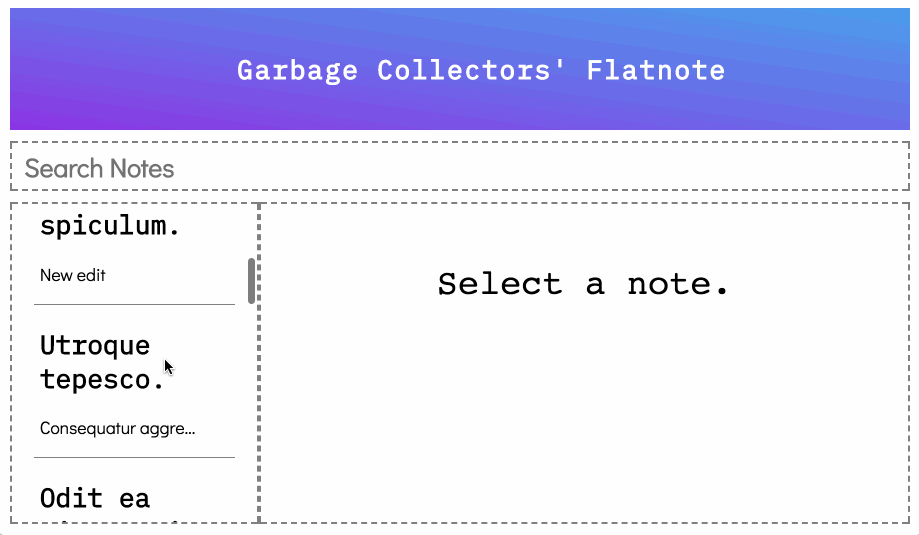
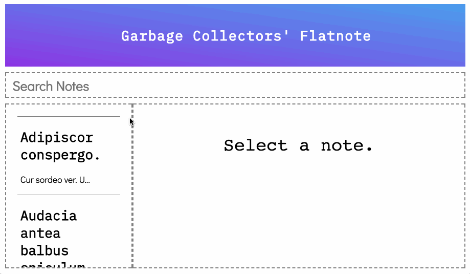

# React Evernote Guided Project

In this guided project, we'll be building an Evernote-like application built
with a React frontend and Rails backend.

Your goal will be to complete the baseline deliverables using the provided
starter code and then make this project your own by building out unique stretch
goals. Some suggestions are listed below, but try to be creative!

## Requirements

- [ ] Complete all of the _Deliverables_.
- [ ] Build out at least 1 stretch goal feature.

## Setup

The codebase is split up into a Rails API backend and a React frontend.
Everything is contained in this single repository. Your Rails code is located
inside of the `backend` folder and your React code is located inside of the
`frontend` folder.

Each of those folders has a README file with setup instructions. For
conciseness, those instructions are copy pasted here:

### Frontend

```sh
# from within the frontend directory:
npm install
npm start
```

This React app will be running on `http://localhost:4000`.

### Backend

```sh
# from within the backend directory:
bundle install
rails db:create db:migrate db:seed
rails s
```

Your Rails backend API will be running on `http://localhost:3000`.

#### User ID

The seed file should create one user for you, so your default `USER_ID` should
be `1`. If that doesn't work, debug it with the `/api/v1/users` route as shown
below.

#### Routes

| Method | Route               |                               Headers                               |         Body         |
| ------ | ------------------- | :-----------------------------------------------------------------: | :------------------: |
| GET    | `/api/v1/users`     |                                                                     |                      |
| GET    | `/api/v1/notes`     |                                                                     |                      |
| POST   | `/api/v1/notes`     | `'Content-Type': 'application/json'`;`'Accept': 'application/json'` | title, body, user_id |
| PATCH  | `/api/v1/notes/:id` | `'Content-Type': 'application/json'`;`'Accept': 'application/json'` | title, body, user_id |

**Tips:**

- Test out your routes with [Postman](https://www.getpostman.com/) to see how
  they work and what they return.
- Look at the source code! There are many more routes that are not listed that
  may make your life easier. Use those development skills and hack the code!

## Provided Code

### Backend Code

- The entire backend API is complete for the baseline deliverables.
- You should not have to modify this code unless you want to add stretch
  features that are not currently supported by this API.

### Frontend Code

- All CSS styles are provided for you.
- Many components are provided for you, but most are not completely functional.
  It is your job to read the code and figure out how to incorporate it into your
  app.

## Deliverables

Look at the gif below to see how the app should look and behave. These are the
baseline deliverables you need to complete:

### Viewing and Displaying Notes

- [ ] Display all notes in the left sidebar.
- [ ] Displayed sidebar notes should show the title and a truncated body.
- [ ] When a note from the sidebar is clicked, display its contents in the right
      panel.


### Filtering Notes

- [ ] Implement the filter to search through your notes list by title.



### Creating Notes

- [ ] At the bottom of your left sidebar, show a `New` button.
- [ ] Clicking `New` will create a new note via a `POST` request with some
      default title and body. **NOTE**: You don't have to use any kind of `<form>`
      element for this deliverable; you can create an object with a default title
      and body text when the button is clicked. Make sure to check the
      [Routes](#Routes) section of this README to determine what data you need in
      the body of your request.
- [ ] This new note should appear in the sidebar.


### Editing Notes

- [ ] When displaying a note in the right panel, show an `Edit` button.
- [ ] Clicking the `Edit` button will allow the user to edit the title and body
      in the right panel.
- [ ] When in edit mode, also show a `Save` button which saves the note via a
      `PATCH` request.
- [ ] When in edit mode, also show a `Cancel` button which discards any changes
      and reverts back to displaying the note.
- [ ] Clicking a different note while in edit mode should discard your changes
      and display the new note instead.



## Stretch Goals

When you are finished with the _deliverables_, you can build out any new
features that you want. This is your chance to be creative and make your project
unique!

Some suggestions:

- Add the ability to filter by body, date created, date edited, etc.
- Sorting by date created, date edited, alphabetical, etc.
- Use `react-router` to create a multi-page app
- User signup & login
- Sharing notes with other users
- Rich text formatting
- Tagging
- Emailing notes
